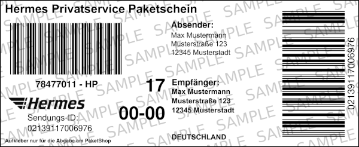

# [`snake_label`](https://snake-label.de)
Converts large format shipping labels to 62mm `snake_labels` for label printers.

## Features and benefits
- **smaller and handier**: sticky labels instead of giant plain paper pages
- **as short as possible**: more labels for your money!
- **sharp 2D-/barcodes**: for best scanability
- **without backend**: crops completely locally via JS (keep your address safe!)
- optimized for 300dpi
- optimised PNGs for direct printing via [brother_ql](https://github.com/pklaus/brother_ql)

Currently available labels
---------------------------

### DHL

#### `dhl_national_privat`
- **Size:** 62x142mm
- **Note:** Zusatzleistungen and Warnings are not included in these labels (yet?).

_[no sampe image yet]_
<!--  -->

#### `dhl_international_eu_privat`
[DHL native countries, eg. NL]
- **Size:** 62x164mm
- **Note:** *Zusatzleistungen and Warnings are not included in these labels (yet?).*

_[no sampe image yet]_
<!--  -->

#### `dhl_retoure` (Deutschland)
- **Size:** 62x144mm

International returns are most probably better on a real paper sheet/A5 Label.

### Hermes

#### `hermes_privat (V 1.0.2)`
- **Size:** 62x150mm

## ToDos
- page styling
- multi-file processing
- more labels...
- cli / ~~Electron~~ Tauri app

---
## Dependencies & Licenses
`snake_label` is licensed under [GPL-3.0](LICENSE).

- [PDF-LIB](https://github.com/Hopding/pdf-lib) (c) Andrew Dillon | MIT License
- [PDF.js](https://github.com/mozilla/pdf.js) (c) Mozilla Foundation | Apache-2.0 License
- [downloadjs](https://github.com/rndme/download) (c) dandavis | MIT License
- [laravel-mix](https://github.com/laravel-mix/laravel-mix) (c) Jeffrey Way | MIT License

Made possible by [@catSIXe](https://github.com/cheetahdotcat). :octocat:
